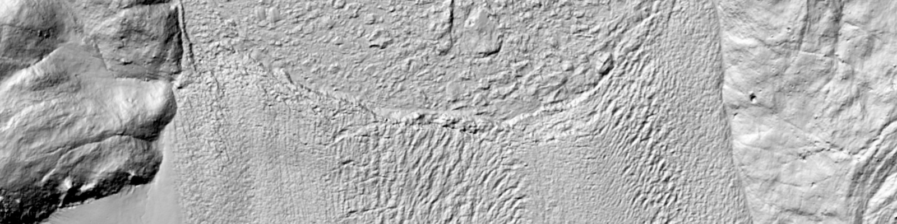
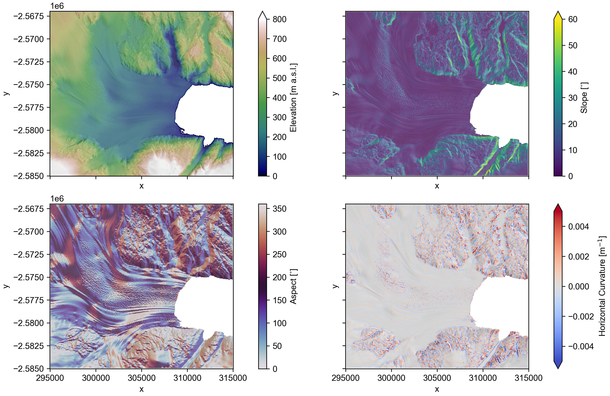
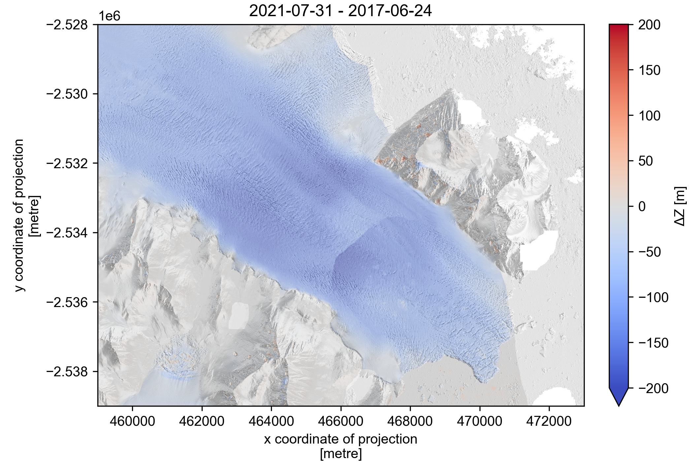
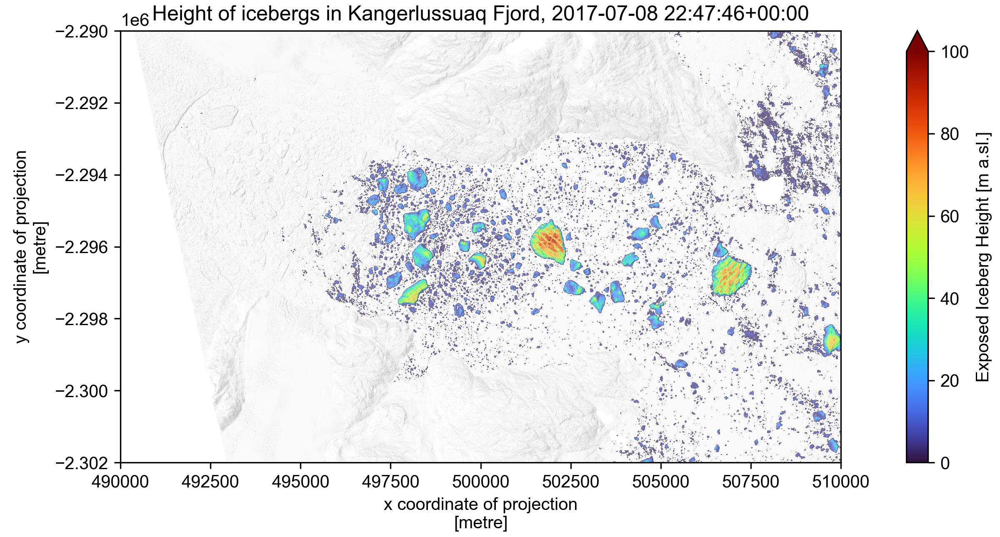

# pDEMtools

__Conveniently search, download, and preprocess ArcticDEM and REMA products__

[](https://pdemtools.readthedocs.io/en/latest/?badge=latest) [](https://github.com/trchudley/pdemtools/actions/workflows/unit_test.yml)



pDEMtool provides a convenient set of functions to explore, download, and preprocess high-resolution DEMs of the polar regions from the ArcticDEM (Porter _et al._  2022; 2023) and Reference Elevation Model of Antarctica (REMA; Howat _et al._ 2022a, b) products, courtesy of the Polar Geospatial Center (PGC).

The first aim of pDEMtools is to enable access to ArcticDEM and REMA mosaics and multitemporal strips using the `search()` function and `load` module:

 - **`search()`**: This function aims to replicate the kind of convenient catalogue searching available when querying a dynamic STAC catalogue (e.g. `pystac_client`), allowing users to easily find relevant ArcticDEM and REMA strips for their areas of interest. 
 - **`load`**: This module provides simple one-line functions to preview and download strips and mosaics from the relevant AWS bucket to an `xarray` Dataset.

The second aim is to provide (pre)processing functions _specific_ to the sort of uses that ArcticDEM and REMA users might want (e.g. a focus on ice sheet and cryosphere work), as well as the particular _strengths_ of ArcticDEM and REMA datasets (high-resolution and multitemporal). Tools include:

 - Terrain attribute derivation (hillshade, slope, aspect, various curvatures) using a 5x5 polynomial fit suited for high-resolution data.
 - Quick geoid correction using BedMachine source data.
 - Simple coregistration for quick elevation change analysis.
 - Identifying/masking sea level and icebergs.

Rather than introducing custom classes, pDEMtools will always try and return DEM data as an [xarray](https://docs.xarray.dev/en/stable/) DataArray with geospatial metadata via the [rioxarray](https://corteva.github.io/rioxarray/stable/) extension. The aim is to allow the user to quickly move beyond pDEMtools into their own analysis in whatever format they desire, be that `xarray`, `numpy` or `dask` datasets, DEM-specific Python packages such as [`xdem`](https://github.com/GlacioHack/xdem) for advanced coregistration or [`richdem`](https://github.com/r-barnes/richdem) for flow analysis, or exporting to geospatial file formats for analysis beyond Python.

Please visit the [pDEMtools ReadTheDocs](https://pdemtools.readthedocs.io/en/latest/index.html) for more information on installing and using pDEMtools.

# Examples

Quickly download and filter the ArcticDEM/REMA mosaic, and generate various terrain attributes such as hillshade and curvatures ([see notebook](./notebooks/mosaic_and_terrain.ipynb)):

<p align="center">
   <a href='./notebooks/mosaic_and_terrain.ipynb'>
   
   </a>
</p>

Search and download ArcticDEM/REMA strips, with easy coregistration to assess elevation change ([see notebook](./notebooks/strip_search_and_dem_difference.ipynb)):

<p align="center">
   <a href='./notebooks/strip_search_and_dem_difference.ipynb'>
   
   </a>
</p>

Easy filtering of ocean/mélange, allowing for assessment of calving fronts and icebergs ([see notebook](./notebooks/get_icebergs.ipynb)):

<p align="center">
   <a href='./notebooks/get_icebergs.ipynb'>
   
   </a>
</p>

An example batch download and coregistration script is also included in the `batch` directory as a jumping-off point for large-scale projects.


# Cite

<!-- 
Update when v.1.0 uploaded to Zendoo.
 -->

 The use of the pDEMtools package can be cited as follows:


> Chudley, T. R. (2023) pDEMtools (v0.6). GitHub. https://github.com/trchudley/pDEMtools

or by using `bibtex`:

```
@software{pDEMtools
   author = {Chudley, Thomas Russell}, title = {pDEMtools}, year = 2023, publisher = {GitHub}, version = {0.6}, url = {https://github.com/trchudley/pDEMtools} 
}
```

When using ArcticDEM and REMA products, please [cite](#refererences) the datasets appropriately and [acknowledge](#acknowledgements) the PGC.

Several algorithms implemented in the library were developed by others. These will be highlighted in the documentation, and the original authors should be properly cited when used. For example:

> We masked sea ice and melange following the method of Shiggins _et al._ (2023) as implemented in pDEMtools (Chudley, 2023).


<!-- 
# Features

> **Note**
> To get up and running quickly, a set of Jupyter Notebooks is provided in the [`notebooks` directory](./notebooks/) so that pDEMtools can be seen in action. 

An introduction the range of functions provided by pDEMtools is provided in the section below. pDEMtools is fully documented via docstrings, and complete instructions as to how to use individual functions can always be quickly accessed using Python's `help()` function (e.g. `help(pdemtools.load.mosaic)`). 

   - [`search()` function](#search-function)
   - [`load` module](#load-module)
      - [`mosaic()`](#loadmosaic)
      - [`preview()`](#loadpreview)
      - [`from_search()`](#loadfrom_search)
      - [`from_id()`](#loadfrom_search)
      - [`from_fpath()`](#loadfrom_fpath)
   - [`data` module](#data-module)
      - [`geoid_from_bedmachine()`](#datageoid_from_bedmachine)
      - [`geoid_from_raster()`](#datageoid_from_raster)
      - [`bedrock_mask_from_bedmachine()`](#databedrock_mask_from_bedmachine)
      - [`bedrock_mask_from_vector()`](#databedrock_mask_from_vector)
      - [`mask_from_geometry()`](#datamask_from_geometry)
 - [`pdt` xarray accessor](#pdt-xarray-accessor)
   - [`geoid_correct()`](#pdtgeoid_correct)
   ### - [`mask_blunders`](#mask_blunders)
   - [`mask_ocean()`](#pdtmask_ocean)
   - [`mask_icebergs()`](#pdtcurvature)
   - [`get_sea_level()`](#pdtget_sea_level)
   - [`coregister()`](#pdtcoregister)
   - [`terrain()`](#pdtterrain)


## `search()` function

Search and filter ArcticDEM and REMA 2 m strips. To see in action, consult the notebooks.

<details> <summary>Expand</summary>

Note: using this function requires a local copy of the ArcticDEM or REMA strip indexes available from the PGC (see ['supplementary datasets' section](#supplementary-datasets)), preferably in a `.parquet` format for speed. The location of the index must be provided via the `index_fpath` variable.

The function has a number of optional inputs allowing for filtering and selection of strips, including:
 -`bounds`: Filter to strips that intersect with bounds, as an [xmin, ymin, xmax, ymax] tuple or shapely Polygon of the desired search region, in in EPSG:3413 (ArcticDEM) or EPSG:3031 (REMA).
 - `min_aoi_frac`: Filter to strips than cover more the defined fraction of the area of interest (defined by the `bounds` variable). Must be between 0 and 1.
 - `dates`: Filter strips to a date range. Dates can be provided as a tuple of two strings, or a single string with a `/` seperator. Date strings must be interpetable by the pandas.to_datetime() tool.
 - `months`: Filter strips to only certain months. Provide as a tuple of integers (e.g. for June, July, August strips only, set `months = [6,7,8]`).
 - `years`: Filter strips to only certain yeara. Provide as a tuple of integers (e.g. for 2011 and 2021  only, set `years = [2011,2021]`).
 - `baseline_max_hours`: Filter strips to only those constructed from stereopairs acquired less than the provided number of hours apart.
 - `sensors`: Filter scenes to only those consrtructed from the provided satellite sensors. Full list is `["WV03", "WV02", "WV01", "GE01"]`.
 - `is_xtrack`: Filter based on whether stereopairs are cross-track imagery. True = return only cross-track. False = return only non-cross-track.
 - `accuracy`: accuracy: Filter to strip accuracies based on the provided average height accuracy in metres (`avg_expect` in the strip index). NB that this column included NaN values (-9999.0) so the option is provided to include only a single value as an upper range (e.g. 2), or a tuple of two values in order to include a lower bound and filter NaN values (e.g [0, 2]).

Example:

```python
search_output = pdemtools.search(
    index_fpath='.../ArcticDEM_Strip_Index_s2s041.parquet', 
    bounds=(458000, -2536000, 469000, -2528000), 
    dates = '20100101/20221231',
    months = [6,7,8,9],
    years = [2011,2021],
    baseline_max_days = 1,
    sensors=['WV03', 'WV02', 'WV01'],
    accuracy=[0, 2],
    min_aoi_frac = 0.7,
)
```

</details>
<br></br>

## `load` module

A range of functions for loading ArcticDEM and REMA mosaics and strips.

<details> <summary>Expand</summary>

### `load.mosaic()`

Download a selection region of the ArcticDEM or REMA mosiac. Given a dataset, resolution, and bounding box, . The resolution must be one of 2, 10, or 32 m.

Example:
```python
dem = pdemtools.load.mosaic(dataset='arcticdem', resolution=10, bounds=[xmin, ymin, xmax, ymax])
```


### `load.from_search()`

Loads a 2 m DEM strip from the AWS bucket based on the output of the `pdemtool.search()` function. Takes a row from the search output (selected through e.g. the `.isel[[i]]` selector). Option to filter to bounds and apply bitmask (defaults to True)

Example:
```python
aoi = (458000, -2536000, 469000, -2528000)
dem = pdemtools.load.from_search(search_output.isel[[0]], bounds=aoi, bitmask=True)
```

### `load.preview()`

Alternative to `load.from_search()`: loads only the 10 m hillshade from the AWS bucket, in order to quickly assess DEM strip quality.

Example:
```python
aoi = (458000, -2536000, 469000, -2528000)
dem = pdemtools.load.from_search(search_output.isel[[0]], bounds=aoi)
```

### `load.from_id()`

Alternative to `load.from_search()`: loads 2 m DEM from the AWS bucket based not on the search output from from a provided dataset (`arcticdem`/`rema`), geocell, and DEM ID. Useful if you already know what strip you want outside of the `search()` function.

Example:
```python
geocell = 'n66w035’
dem_id = 'SETSM_s2s041_WV02_20210731_10300100C359CF00_10300100C37C8000_2m_lsf_seg1’
aoi = (458000, -2536000, 469000, -2528000)

dem = pdemtools.load.from_id(dataset='arcticdem', geocell=geocell, dem_id=dem_id, bounds=aoi)
```

### `load.from_fpath()`

Loads an ArcticDEM or REMA strip directly from a known filepath. Useful for local copies. Optional bitmask provision.

Example:
```python
aoi = (458000, -2536000, 469000, -2528000)
dem = pdemtools.load.from_fpath(dem_fpath='.../demstrip.tif', bounds=aoi, bitmask_fpath='.../dembitmask.tif')
```

</details>
<br></br>

## `data` module

Load helpful supplementary data from BedMachine or other sources.

<details> <summary>Expand</summary>

### `data.geoid_from_bedmachine()`

Extracts the BedMachine geoid (EIGEN-6C4), bilinearly resampled to match the target dataset.

Example:
```python
bm_fpath = '.../BedMachineGreenland-v5.nc'
geoid = pdemtools.data.geoid_from_bedmachine(bm_fpath, dem)
```

### `data.geoid_from_raster()`

Extracts an arbritary geoid stored as a raster dataset, bilinearly resampled to match the target dataset.

Example:
```python
geoid_fpath = '.../geoid.tif'
geoid = pdemtools.data.geoid_from_raster(geoid_fpath, dem)
```

### `data.bedrock_mask_from_bedmachine()`

Construct boolean bedrock mask from bedmachine and a given target rioxarray dataset. Returns mask where bedrock values are 1 and outside are 0.

Example:
```python
bm_fpath = '.../BedMachineGreenland-v5.nc'
bedrock_mask = pdemtools.data.bedrock_mask_from_bedmachine(bm_fpath, dem)

```

### `bedrock_mask_from_vector()`

Construct boolean bedrock mask from a Geopandas-readable vector file (e.g. shapefile, geopackage, etc.) of bedrock areas and a given target rioxarray dataset. Returns mask where bedrock values are 1 and outside are 0.

Example:
```python
vector_fpath: '.../bedrock.shp'
bedrock_mask = pdemtools.data.bedrock_mask_from_vector(vector_fpath, dem)
```

</details>
<br></br>

## `.pdt` xarray accessor

A number of useful filtering and processing functions that can be accessed as an xarray accessor. For instance. to use the `.pdt.mask_ocean()` function on your loaded DEM with the variable name `dem`, the correct instruction is `dem_masked = dem.pdt.mask_ocean()`. 

<details> <summary>Expand</summary>

### `.pdt.geoid_correct()`

After having loaded your geoid using either `data.geoid_from_bedmachine()` or `data.geoid_from_raster()`, you can apply it using this function. 

Example:
```python
bm_fpath = '.../BedMachineGreenland-v5.nc'
geoid = pdemtools.load.geoid_from_bedmachine(bm_fpath, dem)
dem_geoid_corrected = dem.pdt.geoid_correct(geoid)
```

### `.pdt.mask_ocean()`

At marine-terminating glacier front, the DEM may also include sea ice and mélange. To filter out these regions, this function adapts the method of Shiggins _et al. (2023), identifying sea level as the model 0.25 m bin of a histogram of 'near-geoid' (±10 m) values and filtering out values within 5 m this identified sea level. In order to avoid messing with DEMs that contain no sea level, the DEM requires at least 1 km<sup>2</sup> of 'near-geoid' values to work, or it will return the original DEM.

> **Warning** 
> The input DEM must be geoid-corrected for this function to work correctly.

All of the values mentioned above can be altered using input variables `candidate_height_thresh_m` ('near geoid' values threshold),  `candidate_area_thresh_km2` (minimum required 'near geoid' values), and `near_sealevel_thresh_m` (filter out all DEM regions within this distance of the sea level). Additionally, the `return_mask` flag will return the ocean mask, rather than the filtered DEM if flagged `True`. 

Example:
```python
dem_masked = dem_geoid_corrected.pdt.mask_ocean()
```

### `.pdt.get_sea_level()`

A subset of the `.pdt.mask_ocean()` function, this function simply returns the sea level derived from the Shiggins _et al._ (2023) method. It accepts `candidate_height_thresh_m` and `candidate_area_thresh_km2` variables if defaults are not acceptable.

Example:
```python
dem_masked = dem_geoid_corrected.pdt.get_sea_level()
```

### `.pdt.mask_icebergs()`

After masking the ocean/sea ice/mélange, icebergs will remain. This could be desired (it is indeed the whole point of the Shiggins _et al._ (2023) algorithm) but if not, this function gives you the opportunity to mask them as well (or return a mask of the icebergs, if `return_mask` == True). The function will remove all groups of connected pixels that are less then the threshold designated by `area_thresh_m2` (defaults to `1e6`, i.e. 1 km<sup>2</sup>).

Example:
```python
dem_iceberg_masked = dem_ocean_masked.pdt.mask_icebergs()
```

### `.pdt.coregister()`

Coregisters the scene against a reference DEM based on the Nuth and Kääb (2011) method. This is based off code used in the [PGC postprocessing pipeline](https://github.com/PolarGeospatialCenter/setsm_postprocessing_python/blob/fd36fd54933ec43f587902a4fdcd1acbd90951c2/lib/scenes2strips.py). If there is a known stable topography, this can be loaded as a mask via the `stable_mask` variable (where `1` = stable region to be used for coregistration). The `data` module provides opportunities for creating these masks (e.g. `data.bedrock_mask_from_bedmachine()`).

In the coregistraion processing chain, the slope is calculated following the Florinsky (2009) method (see the [`.pdt.terrain()`](#pdtterrain) section for more information).

Example:
```python
bm_fpath = '.../BedMachineGreenland-v5.nc'
bedrock_mask = pdemtools.data.bedrock_mask_from_bedmachine(bm_fpath, dem)

dem_coregistered = dem.pdt.coregister(reference_dem, stable_mask=bedrock_mask)
```

### `.pdt.terrain()`

Calculates geomorphometric terrain attributes from the following list:

```python
variable_list = [
    'slope', 
    'aspect', 
    'hillshade',
    "horizontal_curvature",
    "vertical_curvature",
    "mean_curvature",
    "gaussian_curvature",
    "unsphericity_curvature",
    "minimal_curvature",
    "maximal_curvature",
]
```

The geomorphometric parameters used to calculate these variables ($\frac{\partial z}{\partial x}$, $\frac{\partial z}{\partial y}$, $\frac{\partial^2 z}{\partial x^2}$, $\frac{\partial^2 z}{\partial y^2}$, $\frac{\partial^2 z}{\partial x \partial y}$) are, by default, derived following Florinsky (2009), as opposed to more common methods (e.g. Horn, 1981, or Zevenbergen & Thorne, 1987). 

The motivation here is that Florinsky (2009) computes partial derivatives of elevation based on fitting a third-order polynomial, by the least-squares approach, to a 5x5 window, as opposed to the more common 3x3 window. This is more appropriate for high-resolution DEMs: curvature over a 10 m window for the 2 m resolution ArcticDEM/REMA strips will lead to a local deonising effect that limits the impact of noise. 

If you would rather calculate these variables using a more traditional method, you can add `method = 'ZevenbergThorne'` to the `.pdt.terrain()` function to calculate following Zevenbergen or Thorne (1987). There are also a number of hillshade options: `hillshade_altitude`, `hillshade_azimuth` to alter the hillshade direction, `hillshade_multidirectional` to instead calculate a multidirectional hillshade following the GDAL-implemented USGS method (Mark, 1992), and `hillshade_z_factor` to alter the scaling factor (defaults to 1).

Example:
```python
terrain = dem_masked.pdt.terrain(
   ['slope', 'hillshade', 'mean_curvature'], 
   hillshade_z_factor=2, 
   hillshade_multidirectional=True
)
```

If you have requested multiple variables, the output of the `.pdt.terrain()` is a (rio)xarray DataSet containing all the selected variables, as well as the original DEM. If you have requested a single variable, the output is a (rio)xarray DataArray of that variable.

</details>
<br></br> 
-->


<!-- # To do

The tool is presented _as-is_, but requests/contributions to functionality are welcome (thomas.r.chudley@durham.ac.uk). Avenues for future work include the following:

 - Quicker preview downloads of hillshades and DEMs through use of the GeoTIFF overviews and the `rxr.open_rasterio()` `overview_level` function. This can result in uneven x/y resolutions though, so perhaps another option for upsampling may be useful as an accessor utility.
 - Implement Ian Howat's blunder filter algorithm. -->


# Refererences

<!-- <details> <summary>Expand</summary> -->

<!-- Florinsky, I. V. (2009). Computation of the third‐order partial derivatives from a digital elevation model. _International journal of geographical information science_, 23(2), 213-231. https://doi.org/10.1080/13658810802527499 -->

Howat, I., _et al._ (2022a). The Reference Elevation Model of Antarctica – Strips, Version 4.1. _Harvard Dataverse_ https://doi.org/10.7910/DVN/X7NDNY

Howat, I., _et al._ (2022b). The Reference Elevation Model of Antarctica – Mosaics, Version 2, _Harvard Dataverse_ https://doi.org/10.7910/DVN/EBW8UC

<!-- Mark, R. K. (1992). Multidirectional, oblique-weighted, shaded-relief image of the Island of Hawaii. _United States Geological Survey_. Open-File Report 92-422. https://doi.org/10.3133/ofr92422 -->

<!-- Morlighem, M. _et al._ (2022a). IceBridge BedMachine Greenland, Version 5 [Data Set]. _NASA National Snow and Ice Data Center Distributed Active Archive Center_. https://doi.org/10.5067/GMEVBWFLWA7X -->

<!-- Morlighem, M. _et al._ (2022b). MEaSUREs BedMachine Antarctica, Version 3 [Data Set]. _NASA National Snow and Ice Data Center Distributed Active Archive Center_. https://doi.org/10.5067/FPSU0V1MWUB6 -->

<!-- Nuth, C. and Kääb, A. (2011) Co-registration and bias corrections of satellite elevation data sets for quantifying glacier thickness change, _The Cryosphere_, 5, 271–290, https://doi.org/10.5194/tc-5-271-2011 -->

Porter, C., _et al._ (2022). ArcticDEM - Strips, Version 4.1. _Harvard Dataverse_. https://doi.org/10.7910/DVN/OHHUKH

Porter, C., _et al._ (2023), ArcticDEM, Version 4.1, _Harvard Dataverse_. https://doi.org/10.7910/DVN/3VDC4W

<!-- Shiggins, C. J., _et al._ (2023). Automated ArcticDEM iceberg detection tool: insights into area and volume distributions, and their potential application to satellite imagery and modelling of glacier–iceberg–ocean systems, _The Cryosphere_, 17, 15–32, https://doi.org/10.5194/tc-17-15-2023 -->

<!-- Zevenbergen, L. W. and Thorne, C. R. (1987). Quantitative analysis of land surface topography. Earth surface processes and landforms, 12(1), 47-56. -->

<!-- </details>
<br></br>  -->


# Acknowledgements

**ArcticDEM:** DEMs are provided by the Polar Geospatial Center under NSF-OPP awards 1043681, 1559691, and 1542736.

**REMA:** DEMs are provided by the Byrd Polar and Climate Research Center and the Polar Geospatial Center under NSF-OPP awards 1543501, 1810976, 1542736, 1559691, 1043681, 1541332, 0753663, 1548562, 1238993 and NASA award NNX10AN61G. Computer time provided through a Blue Waters Innovation Initiative. DEMs produced using data from Maxar.

